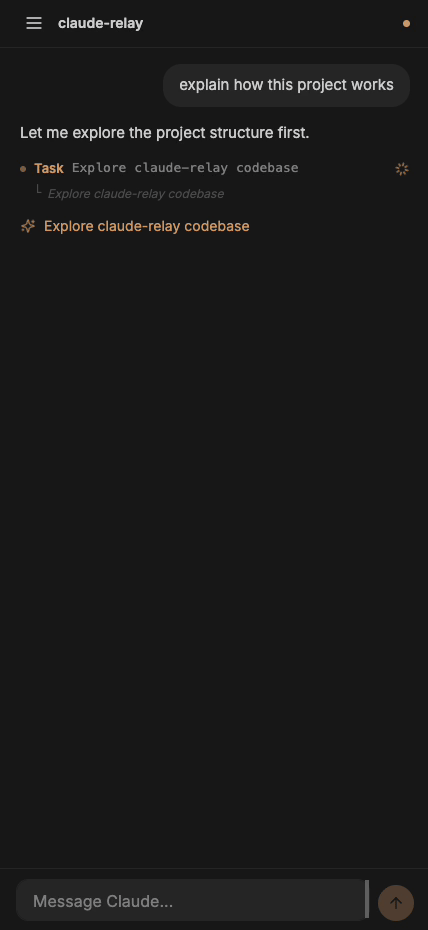

# claude-relay

Run `npx claude-relay` in any directory. Access Claude Code on that directory from any device.



```
$ cd ~/my-project
$ npx claude-relay

  ◆  Claude Relay
  │
  ▲  READ BEFORE CONTINUING
  │
  │  Anyone with access to the URL gets full Claude Code access
  │  to this machine, including reading, writing, and executing
  │  files with your user permissions.
  │
  ◆  PIN protection
  │  6-digit PIN, or Enter to skip
  │  ●●●●●●
  ◇  PIN protection · Enabled
  │
  ◆  Keep awake
  ◇  Keep awake · Yes
  │
  └  Starting relay...

  Claude Relay running at http://100.64.1.5:2633
  my-project · /Users/you/my-project
```

## Why?

You can use Claude Code from the Claude app, but it requires a GitHub repo, runs in a sandboxed VM, and comes with limitations. No local tools, no custom skills, no access to your actual dev environment.

**claude-relay** gives you the real thing. One command in any directory and you get full Claude Code on **your machine**, from any device. Your files, your tools, your skills, your environment. No GitHub required, no sandbox.

## How it works

claude-relay uses the [Claude Agent SDK](https://www.npmjs.com/package/@anthropic-ai/claude-agent-sdk) and bridges it to a web UI over WebSocket. Your browser talks to the relay, the relay talks to Claude Code. Sessions persist across reconnects.

```
Browser (any device)  <-->  claude-relay (your machine)  <-->  Claude Agent SDK
        WebSocket                HTTP/HTTPS + WS
```

## Features

- **One command** — `npx claude-relay` and you're live
- **Mobile-first UI** — designed for phones and tablets, works everywhere
- **HTTPS** — automatic TLS via [mkcert](https://github.com/FiloSottile/mkcert), enabled by default
- **PIN protection** — optional 6-digit PIN set at startup
- **Permission control** — tool approval relayed to the browser (Allow / Allow for Session / Deny)
- **Multi-session** — run multiple Claude Code sessions, switch between them
- **Multi-device sync** — input, messages, and state sync across connected devices in real-time
- **Streaming** — real-time token streaming, tool execution, thinking blocks
- **Session persistence** — sessions survive server restarts and reconnects
- **Tailscale-aware** — prefers Tailscale IP for secure remote access
- **Slash commands** — full slash command support with autocomplete
- **Keep awake** — optional macOS caffeinate to prevent sleep while running
- **Zero config** — no API keys, no setup. Uses your local `claude` installation

## Requirements

- [Claude Code CLI](https://docs.anthropic.com/en/docs/claude-code) installed and authenticated
- Node.js 18+
- [mkcert](https://github.com/FiloSottile/mkcert) (optional, for HTTPS)

## Install

```bash
# Run directly (no install needed)
npx claude-relay@latest
```

## Usage

```bash
# Start in current directory
npx claude-relay

# Custom port (default: 2633)
npx claude-relay -p 8080

# Disable HTTPS
npx claude-relay --no-https
```

Then open the URL on any device connected to the same network, or scan the QR code shown in the terminal.

### HTTPS setup

HTTPS is enabled by default when [mkcert](https://github.com/FiloSottile/mkcert) is installed. To set it up:

```bash
brew install mkcert
mkcert -install
```

claude-relay will automatically generate certificates on first run. If mkcert is not installed, it falls back to HTTP.

### Remote access with Tailscale

claude-relay automatically detects [Tailscale](https://tailscale.com) and uses your Tailscale IP. Install Tailscale on your machine and phone, and you can access Claude Code from anywhere.

## Issues

Found a bug or have a feature request? [Open an issue](https://github.com/chadbyte/claude-relay/issues).

## Security

**Anyone with access to the URL gets full Claude Code access to your machine**, including reading, writing, and executing files with your user permissions. PIN protection adds a layer of access control, but is not a substitute for network-level security.

We strongly recommend using a private network layer such as [Tailscale](https://tailscale.com), WireGuard, or a VPN. claude-relay automatically detects Tailscale and prefers its IP for this reason.

If you choose to expose it beyond your private network, that's your call. **Entirely at your own risk.** The authors assume no responsibility for any damage, data loss, or security incidents.

## Disclaimer

claude-relay is an independent, unofficial project. It is not affiliated with, endorsed by, or sponsored by Anthropic. "Claude" is a trademark of Anthropic.

## License

MIT
