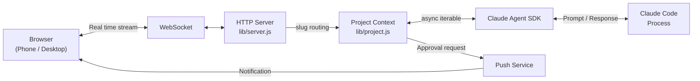

# claude-relay

<p align="center">
  
</p>

<h3 align="center">Web UI for Claude Code. Any device. Push notifications.</h3>

Claude Code. Anywhere.  
Same session. Same files. Same machine.  
Your files stay on your computer. Nothing leaves for the cloud.

Pick up the same Claude Code session on your phone.  
Start in the terminal, continue on your phone, switch back anytime.  
Same session, same files, now in your pocket.

Claude Code is automating more of your editing and execution workflow.
But when it needs approval or asks a question, it halts in the terminal. If you walk away, it just sits there waiting.

claude-relay eliminates this bottleneck.
It is not a thin wrapper that intercepts input/output. It drives Claude Code via the Claude Agent SDK and relays the stream from your local machine to your browser.

Get approval notifications while grabbing a coffee.
Continue working from the sofa on your iPad.
Split your browser: claude-relay on one side, your app preview on the other, and watch the code change in real time.

```bash
cd ~/your-project
npx claude-relay
# First run: Set Port/PIN -> Scan QR -> Connect
```

---

## Never Miss an Approval

When Claude Code requests permission before executing a tool, you get a notification on your phone.
One tap, and Claude Code gets back to work.

<p align="center">
  
</p>

It works in browser tabs too. When input is awaited, the favicon blinks and the tab title changes to alert you.

## Side by Side Workflow

Keep claude-relay on one side and your localhost on the other.
Watch the results update live while Claude Code fixes your source files.

Mermaid diagrams render as diagrams, and tables appear as actual tables.
You can explore files in the sidebar and use the built-in terminal to run shell commands.

## All in One Place

Run `npx claude-relay` in each project to register them to the same server.
Manage all your active sessions from a single dashboard.

```bash
cd ~/projects/backend && npx claude-relay    # Register project
cd ~/projects/frontend && npx claude-relay   # Adds to the same server
```

The server runs in the background. Even if you close the terminal window, your sessions and the server remain active.

---

## Getting Started

```bash
npx claude-relay
```

<p align="center">
  
</p>

On the first run, you'll set a port and PIN to launch the server.
Scan the QR code with your phone to connect instantly, or open the URL displayed in your terminal.

## Key Features

* **Push Approvals** - Approve or reject from your phone while away, so Claude Code does not get stuck waiting.
* **Multi Project Daemon** - Manage all projects via a single port.
* **Auto Session Logs (JSONL)** - Conversations and execution history are always saved locally. No data loss on crashes or restarts. Location: `./.claude-relay/sessions/`
* **File Browser and Terminal** - Inspect files and execute commands directly from the browser.

> Note: Session logs may contain prompts, outputs, and commands. Do not share this folder.

<details>
<summary>View Full Feature List</summary>

**Notifications**

* **Push Notifications** - Approvals, completions, errors, and questions. Add to Home Screen (PWA) to receive notifications without opening the app. Behavior depends on OS and browser. Tested on iPhone (Home Screen PWA) and desktop Chrome.
* **Favicon and Title Blinking** - Visual cues when input is awaited.
* **Sound Alerts** - Supports browser notifications, desktop notifications, and audio alerts.

**Projects and Sessions**

* **Multi Project** - Single port management for all projects.
* **Project Names** - Custom names make it easy to distinguish tabs.
* **Session Persistence** - Sessions survive server restarts, browser crashes, and network drops.
* **Session Handoff** - Start in the terminal, continue on your phone, pass back to desktop.
* **Rewind (Native Claude Code)** - Accessible directly from the browser UI.

**Rendering and Tools**

* **Mermaid and Markdown** - Proper rendering for diagrams, tables, and code blocks.
* **Syntax Highlighting** - Support for over 180 languages with copy buttons on every block.
* **File Browser** - Sidebar navigation with file previews and markdown rendering.
* **Built in Terminal** - Full shell access within the browser.
* **Slash Commands** - Execute standard Claude Code commands from the browser, with autocomplete.

**UI**

* **Mobile Optimized** - Large approve and reject buttons. Behaves like a native app via PWA.
* **Real time Sync** - All devices view the exact same session state.
* **QR Code** - Scan to connect instantly.
* **Image Paste** - Paste images directly from your clipboard into the input.

**Server and Security**

* **Background Daemon** - Server persists even if the CLI is closed.
* **Keep Awake** - Prevents macOS sleep to keep sessions alive. Configurable toggle.
* **PIN Protection** - Restrict access with a 6 digit PIN.
* **HTTPS** - Automatic certificate generation via mkcert.
* **Zero Config** - Inherits your existing Claude Code configuration.

</details>

## Network

On the same Wi Fi, it just works. Open the URL shown in the terminal on any device.

For remote access, [Tailscale](https://tailscale.com) is recommended. Install it on both devices and log in with the same account to connect via an encrypted tunnel without port forwarding. Free for personal use.

## Security

claude-relay opens on your local network to allow access from other devices such as phones and tablets on the same Wi Fi.
Setting a PIN is highly recommended.

Anyone on your network with the URL and PIN can access the session. PIN protection can be enabled during the initial setup.

Do not expose this directly to the public internet. Usage on public or shared networks is not recommended.
For remote access, use [Tailscale](https://tailscale.com) or a VPN.

Users are responsible for their network configuration and exposure scope.

## HTTPS for Push

Basic features work out of the box. Only push notifications require HTTPS.

Set it up once using [mkcert](https://github.com/FiloSottile/mkcert):

```bash
brew install mkcert
mkcert -install
```

Certificates are generated automatically. The setup wizard handles the rest.

If push registration fails: check whether your browser trusts HTTPS and whether your phone can access the address.

## CLI Options

```bash
npx claude-relay              # Default (port 2633)
npx claude-relay -p 8080      # Specify port
npx claude-relay --no-https   # Disable HTTPS
npx claude-relay --no-update  # Skip update check
npx claude-relay --debug      # Enable debug panel
```

## Requirements

* [Claude Code CLI](https://docs.anthropic.com/en/docs/claude-code) installed and authenticated
* Node.js 18+
* [mkcert](https://github.com/FiloSottile/mkcert) - For push notifications (optional)
* [Tailscale](https://tailscale.com) - For remote access (optional)

## Architecture

claude-relay is not a wrapper that intercepts standard input/output.
It is a local relay server that drives Claude Code execution via the [Claude Agent SDK](https://www.npmjs.com/package/@anthropic-ai/claude-agent-sdk) and streams data to the browser via WebSocket.



For a detailed sequence diagram, daemon structure, and design decisions, refer to [docs/architecture.md](docs/architecture.md).

---

## Contributing

Bug fixes and typos are welcome. For feature suggestions, please open an issue first:
[https://github.com/chadbyte/claude-relay/issues](https://github.com/chadbyte/claude-relay/issues)

If you are using claude-relay, let us know how you are using it in Discussions:
[https://github.com/chadbyte/claude-relay/discussions](https://github.com/chadbyte/claude-relay/discussions)

## Disclaimer

This is an independent project and is not affiliated with Anthropic. Claude is a trademark of Anthropic.

## License

MIT
