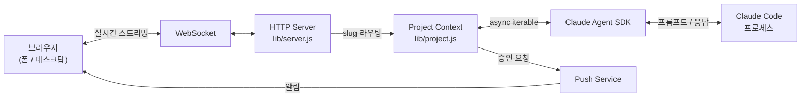
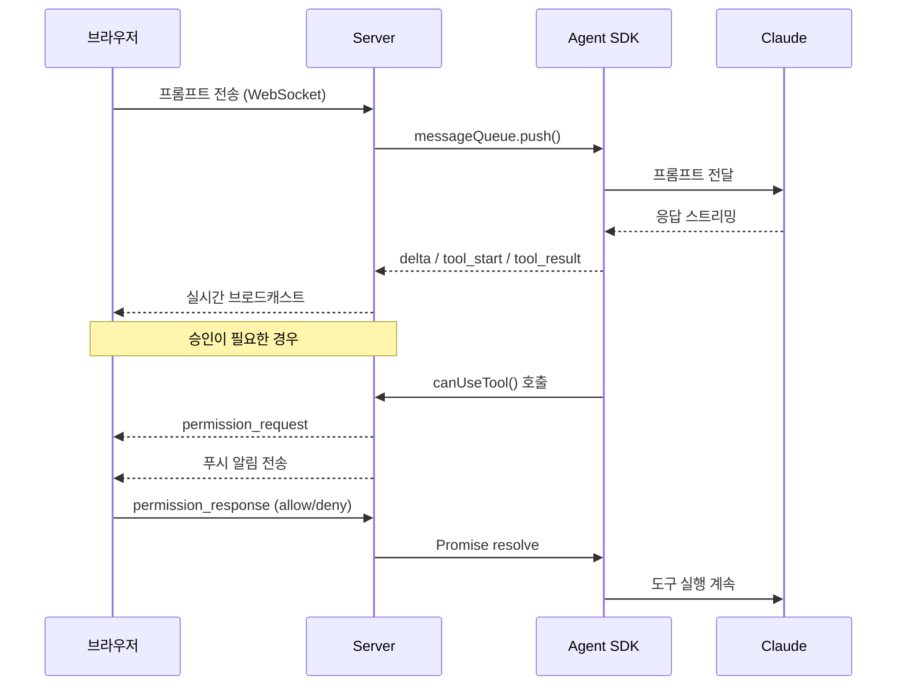
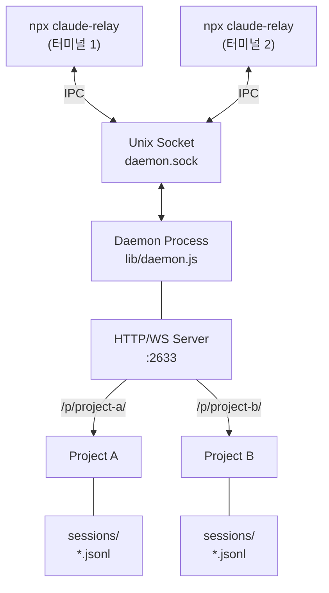

# Architecture

claude-relay는 CLI를 감싸지 않습니다.
[Claude Agent SDK](https://www.npmjs.com/package/@anthropic-ai/claude-agent-sdk)로 Claude Code를 직접 실행합니다.
실행 모델은 그대로 유지하면서, WebSocket으로 브라우저에 스트리밍하는 로컬 릴레이 서버입니다.

## 시스템 구성



## 전체 흐름



## 데몬 구조



CLI는 데몬 프로세스를 `detached: true`로 spawn합니다. CLI를 닫아도 데몬은 백그라운드에서 계속 돌아갑니다. 여러 CLI 인스턴스가 하나의 데몬에 Unix Socket IPC로 연결됩니다.

## 주요 설계 결정

| 결정 | 이유 |
|------|------|
| Unix Socket IPC | CLI와 데몬 간 통신. TCP 포트를 추가로 열지 않음 |
| 백그라운드 데몬 | CLI를 닫아도 서버 유지. `detached: true`로 spawn |
| JSONL 세션 저장 | append-only로 빠르고, 크래시에도 데이터 유실 최소화 |
| Slug 기반 라우팅 | 하나의 포트에서 여러 프로젝트를 `/p/{slug}/`으로 분리 |
| Async Iterable | SDK의 메시지 큐와 응답 스트림을 비동기 이터레이터로 연결 |
| 파일 경로 검증 | symlink resolve + 프로젝트 디렉토리 밖 접근 차단 |
| `0.0.0.0` 바인딩 + PIN | LAN 접근 허용, PIN으로 인증. 외부 노출은 VPN 권장 |

## 세션 저장

세션은 프로젝트 디렉토리의 `.claude-relay/sessions/{cliSessionId}.jsonl`에 저장됩니다.

```
Line 1:  {"type":"meta","localId":1,"cliSessionId":"...","title":"...","createdAt":...}
Line 2+: {"type":"user_message","text":"..."}
         {"type":"delta","text":"..."}
         {"type":"tool_start","id":"...","name":"..."}
         ...
```

append-only JSONL 포맷이라 크래시에도 마지막 줄만 유실됩니다. 데몬 재시작 시 모든 세션 파일을 읽어서 복원합니다.

## 승인 흐름

1. SDK가 `canUseTool()` 콜백을 호출합니다
2. 서버가 Promise를 만들고 `pendingPermissions[requestId]`에 저장합니다
3. 연결된 모든 클라이언트에 `permission_request` 메시지를 보냅니다
4. 푸시 알림을 전송합니다
5. 클라이언트가 `permission_response`를 보내면 Promise를 resolve합니다
6. SDK가 도구 실행을 계속합니다

## 멀티 프로젝트 라우팅

```
/                    → 대시보드 (프로젝트가 1개면 바로 리디렉트)
/p/{slug}/           → 프로젝트 UI
/p/{slug}/ws         → WebSocket 연결
/p/{slug}/api/...    → 프로젝트 API (푸시 구독, 승인 응답, 파일 조회)
```

slug는 프로젝트 디렉토리 이름에서 자동 생성됩니다. 중복 시 `-2`, `-3`이 붙습니다.

## IPC 프로토콜

Unix Domain Socket 위의 line-delimited JSON입니다.

```
CLI → Daemon: {"cmd":"add_project","path":"/home/user/myproject"}\n
Daemon → CLI: {"ok":true,"slug":"myproject"}\n
```

지원 명령: `add_project`, `remove_project`, `get_status`, `set_pin`, `set_project_title`, `set_keep_awake`, `shutdown`
